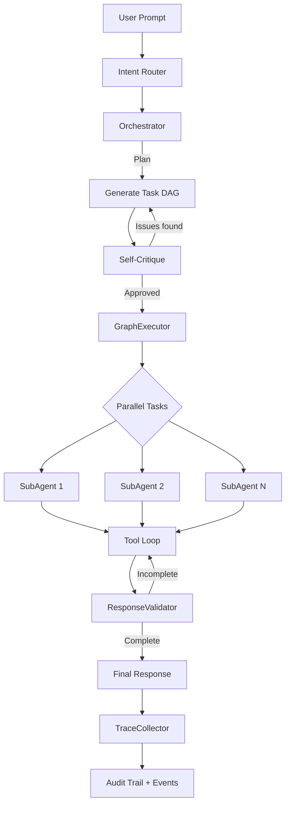

# Agent Pipeline

Every user request flows through a structured **Plan-and-Solve** pipeline. This is the heart of Agile Agent.

## Pipeline Overview



## Stage 1 — Intent Detection

The `intentRouter` determines what the user wants:

1. **Custom triggers** — regex patterns from custom agent definitions (checked first)
2. **Built-in keywords** — hardcoded patterns (`review`, `create stories`, etc.)
3. **LLM fallback** — the LLM classifies ambiguous prompts

Available intents:

| Intent | Triggers | Description |
|--------|----------|-------------|
| `review` | "review", "analyze ticket" | Jira ticket analysis |
| `code_review` | "review MR", "code review" | Merge Request code review |
| `create_stories` | "create stories", "generate stories" | User story generation from epics |
| `implement` | "implement", "extract code" | Code implementation and MR creation |
| `architecture` | "architecture", "design" | Architecture analysis |
| `dependencies` | "dependencies", "scan" | Dependency graph scanning |
| `qa` | "test", "QA" | Test strategy and test case generation |
| `explore` | (sub-agent only) | Read-only codebase search |
| `general` | (LLM fallback) | General-purpose conversation |

## Stage 2 — Orchestration

The `Orchestrator` generates a **task DAG** (Directed Acyclic Graph) as JSON:

```json
{
  "tasks": [
    { "id": "t1", "intent": "review", "tool": "fetch_jira_ticket", "deps": [] },
    { "id": "t2", "intent": "review", "tool": "fetch_jira_ticket_tree", "deps": ["t1"] },
    { "id": "t3", "intent": "review", "tool": "synthesize", "deps": ["t1", "t2"] }
  ]
}
```

After generating the plan, the Orchestrator **self-critiques** it — checking for missing dependencies, bottlenecks, and logical errors. If issues are found, it revises the plan.

## Stage 3 — Parallel Execution

The `GraphExecutor` traverses the DAG:

- Tasks with no unmet dependencies run **in parallel**
- Each task is assigned a specialist `SubAgent` via `SubAgentFactory`
- Each SubAgent runs a **tool-call loop** with the LLM
- If a task fails, the executor triggers **automatic replanning**
- Users can **interrupt** execution at any time

## Stage 4 — Validation

The `ResponseValidator` checks completeness per intent:

- **Code reviews** must contain structured inline comments
- **Story generation** must include Acceptance Criteria
- **Architecture analysis** must cover dependencies

If validation fails, the pipeline automatically retries.

## Stage 5 — Observability

The `TraceCollector` records everything:

- LLM call counts and timing
- Tool execution results
- Token usage
- Full audit trail

All events stream to the frontend via WebSocket in real-time.
