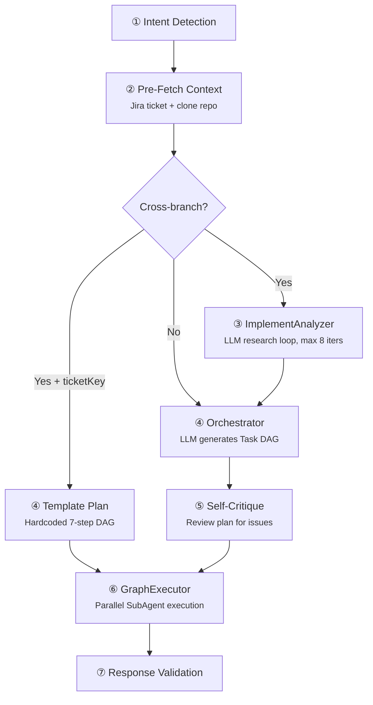
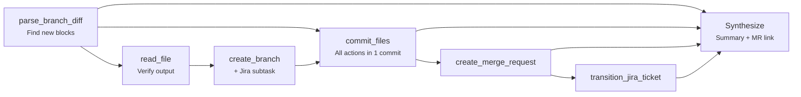
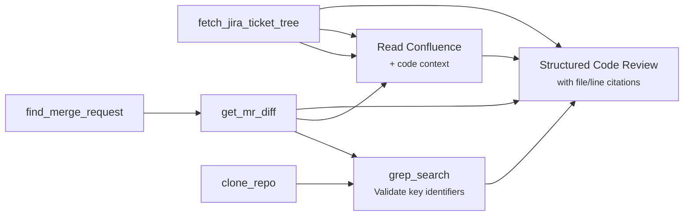

# Agent Workflows

Each built-in agent follows a specific workflow — a structured pipeline of phases and tool calls. This page documents the real execution flows derived from the source code.

## Implement Agent

The most complex agent. Follows a multi-phase **Plan-and-Solve** pipeline.

### Execution Flow

### Default Pipeline (standard implementation)

| Step | Tool | Description |
|------|------|-------------|
| 1 | `fetch_jira_ticket` | Fetch and analyze target ticket requirements |
| 2 | `clone_repo` | Clone the repository (`includeHistory=true`) |
| 3 | `grep_search` / `read_file` | Research codebase: patterns, architecture, relevant files |
| 4 | `create_branch` | Create a feature branch from develop |
| 5 | `edit_file` / `write_file` | Apply code changes |
| 6 | `execute_script` | Run tests and verify changes |
| 7 | `commit_files` | Commit all changes |
| 8 | `create_merge_request` | Open MR with title and description |
| 9 | `transition_jira_ticket` | Transition ticket to "In Review" |

### Cross-Branch Template Plan

When the task is a cross-branch extraction (e.g., moving scenarios between branches), a hardcoded DAG is used:

### ImplementAnalyzer

For cross-branch tasks, a pre-planning **analysis agent** runs before the Orchestrator creates the plan:

- Uses **read-only** tools: `read_file`, `read_files`, `find_files`, `grep_search`, `list_directory`, `file_outline`
- Runs up to **8 LLM iterations** with tool calls
- Produces structured output: Task Understanding → Diff Analysis → New Scenarios → Extraction Plan → Risks
- All file paths are guardrailed to the clone directory

### Tool Inventory (25 tools)

| Category | Tools |
|----------|-------|
| **Jira** | `create_jira_subtask`, `transition_jira_ticket`, `create_jsm_request` |
| **Repo** | `clone_repo`, `run_git`, `parse_branch_diff` |
| **Code Read** | `read_file`, `read_files`, `find_files`, `grep_search`, `list_directory`, `get_symbol_references`, `file_outline` |
| **Code Write** | `edit_file`, `write_file` |
| **Git Ops** | `create_branch`, `commit_files`, `create_merge_request` |
| **Exec** | `execute_script` |
| **Multi-Agent** | `spawn_agent` |
| **External** | `web_fetch`, `ask_user` |
| **State** | `todo_read`, `todo_write`, `load_skill` |

---

## Code Review Agent (`code_review`)

Uses a 6-pass **transformer pipeline** for large MR diffs.

### Transformer Pipeline

| Pass | Name | Purpose |
|------|------|---------|
| 1 | DiffFingerprinter | Classify structural vs logical changes |
| 2 | ChangeGraphBuilder | Group homogeneous changes |
| 3 | HomogeneityScorer | Determine script validation vs LLM review |
| 4 | ScriptValidator | Run automated assertions |
| 5 | DependencyAnalyzer | Group files for context |
| 6 | ReportAssembler | Merge all results into final report |

**Tools:** `read_file`, `read_files`, `file_outline`, `grep_search`, `get_symbol_references`

---

## MR Review Agent (`review_mr`)

Template-based plan that guarantees all context is fetched:

---

## Ticket Review Agent (`review`)

Template-based 4-step pipeline:

| Step | Tool | Description |
|------|------|-------------|
| 1 | `fetch_jira_ticket` | Fetch the ticket data |
| 2 | `fetch_jira_ticket_tree` | Get full tree: parent, children, linked stories |
| 3 | `clone_repo` + `grep_search` | Gather code evidence for review |
| 4 | — | Produce structured review (DoR, INVEST, Quality Score) |

---

## Create Stories Agent (`create_stories`)

| Step | Description |
|------|-------------|
| 1 | Analyze the epic (`fetch_jira_ticket_tree`) |
| 2 | Run **Blast Radius Simulator** via dependency graph |
| 3 | Generate structured User Stories with Acceptance Criteria |
| 4 | **Adversarial Debate** — `StoryCritic` (QA Lead) reviews, up to 2 revision loops |

---

## Sprint Review / Sprint Plan

| Step | Tool | Description |
|------|------|-------------|
| 1 | `search_jira_jql` | Batch fetch all stories in the sprint |
| 2 | `fetch_jira_ticket` | Enrich each story with details |
| 3 | — | Evaluate DoR readiness per story |
| 4 | — | Report blocked/unready stories with recommendations |

---

## Key Source Files

| File | Purpose |
|------|---------|
| `agent/AgentRunner.ts` | Main orchestration — the "conductor" |
| `agent/Orchestrator.ts` | Plan generation (LLM + templates) + critique |
| `agent/GraphExecutor.ts` | DAG traversal with parallel SubAgent execution |
| `agent/SubAgent.ts` | Per-task LLM + tools loop |
| `agent/StateEngine.ts` | Shared state bus between tasks |
| `agent/ImplementAnalyzer.ts` | Pre-planning analysis for cross-branch tasks |
| `agent/ImplementationContextProvider.ts` | Jira + repo pre-fetch for implement |
| `agent/CodeReviewContextProvider.ts` | MR diff pre-fetch for code review |
| `agent/StoryCritic.ts` | Adversarial QA reviewer for story generation |
| `agent/ToolRegistry.ts` | Intent → tool mapping (`INTENT_TOOL_MAP`) |
