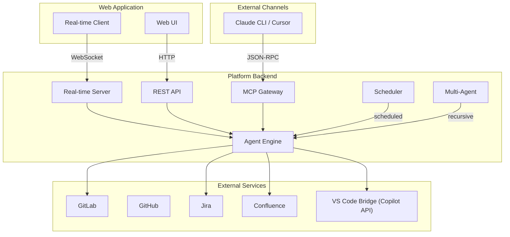
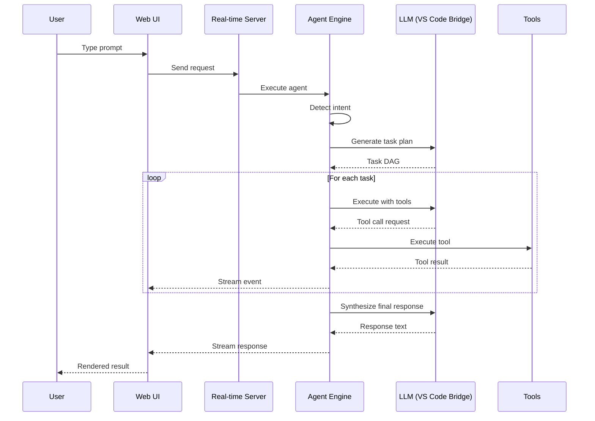

# Architecture

Agile Agent consists of a **TypeScript backend** and a **Vue 3 frontend**, shipped as a single compiled binary.

## High-Level Overview

## How Requests Reach the Agent

All channels converge on a single **Agent Engine** that orchestrates every request.

| Channel | Protocol | Description |
|---------|----------|-------------|
| **Web UI** | WebSocket | Real-time chat with streamed events |
| **REST API** | HTTP | Programmatic access and test runs with optional SSE streaming |
| **MCP Gateway** | JSON-RPC | External AI clients (Claude CLI, Cursor, etc.) |
| **Scheduler** | Internal | Automated cron-based agent runs |
| **Multi-Agent** | Internal | One agent can spawn specialist sub-agents |

## Tech Stack

| Layer | Technology | Purpose |
|-------|-----------|---------|
| **Runtime** | Bun | Compiled binary, no Node.js required |
| **Backend** | Fastify | HTTP server, REST API, WebSocket |
| **AI** | VS Code Bridge | LLM via VS Code Copilot API — enterprise-ready, provider-agnostic. Expandable to additional providers |
| **Database** | SQLite | Projects, conversations, agents, tools, cron jobs |
| **Frontend** | Vue 3 + Vite | Reactive web UI |
| **Communication** | WebSocket + SSE | Real-time event streaming |

## Data Flow

The primary interaction path:

The platform also supports **human-in-the-loop** interactions:
- **Interrupt** — inject additional context while the agent is running
- **Permission approval** — approve or reject tool execution requests
- **Question answering** — respond to agent questions in real-time
