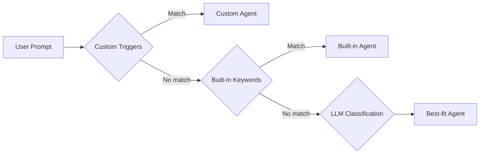

# Intents

Intents are the routing mechanism that determines how the agent handles a user request. Each intent controls the system prompt, tool access, iteration limits, and validation rules.

## Intent Routing Priority

1. **Custom triggers** — regex patterns from `agent_definitions.config_json.triggerKeywords` (highest priority)
2. **Built-in keyword patterns** — hardcoded patterns for standard intents
3. **LLM fallback** — the LLM classifies ambiguous prompts into the best-fit intent

## Built-in Intents

### `review` — Ticket Review
Analyzes Jira tickets for Definition of Ready, INVEST scoring, and quality gaps.

**Tools:** `fetch_jira_ticket`, `fetch_jira_ticket_tree`
**Output:** Structured review with DoR checklist, INVEST scores, and recommendations.

### `code_review` — Code Review
Reviews GitLab Merge Requests with the 6-pass transformer for large diffs.

**Tools:** `gitlab_diff`, `gitlab_file`, `gitlab_mr`, `gitlab_comment`, `run_git`
**Output:** Inline code comments in `<!-- CODE_COMMENTS_START -->` JSON format.

### `create_stories` — Story Generation
Generates user stories from Jira Epics with Acceptance Criteria and blast radius analysis.

**Tools:** `fetch_jira_ticket`, `fetch_jira_ticket_tree`, blast radius tools
**Output:** Structured user stories with INVEST criteria and dependency warnings.

### `implement` — Code Implementation
Implements code changes across branches, creates MRs.

**Tools:** `clone_repo`, `run_git`, `create_branch`, `edit_file`, `write_file`, `commit_files`, `create_merge_request`
**Output:** Committed code changes and an opened Merge Request.

### `architecture` — Architecture Analysis
Analyzes system architecture, API contracts, and design patterns.

**Tools:** `gitlab_search`, `gitlab_file`, `confluence_search`
**Output:** Architecture assessment with dependency diagrams.

### `qa` — Quality Assurance
Generates test strategies, test cases, and identifies edge cases.

**Tools:** `fetch_jira_ticket`, `gitlab_file`
**Output:** Structured test cases covering positive and negative paths.

### `explore` — Codebase Exploration
Read-only intent used by `SpawnAgentTool` for searching and analyzing codebases.

**Tools:** `gitlab_search`, `gitlab_file`, `run_git`, `read_file`, `grep`
**Output:** Search results, code snippets, analysis summaries.

### `general` — General Purpose
Catch-all for conversational requests that don't match a specific intent.

**Tools:** All tools available.
**Output:** Free-form response.

## Custom Intents

You can create custom intents via the **Agent Builder**. Custom agents define:
- **Trigger keywords** — regex patterns (checked before built-in patterns)
- **System prompt** — specialized instructions
- **Tool access** — which tools the agent can use
- **Max iterations** — tool-call loop limit

See [Custom Agents](/docs/customization/custom-agents) for details.
