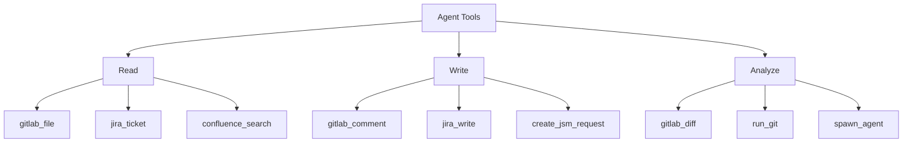
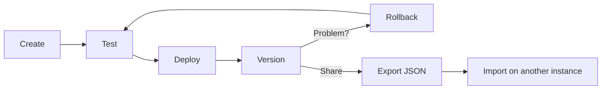

# Custom Agents

Build your own specialized AI agents from 5 building blocks — no coding required.

## What It Does

Custom agents let you create purpose-built AI assistants for your team's specific workflows. Each agent is defined by **5 building blocks** that control its behavior:

> **For BAs & Team Leads:** Think of agents as AI team members with specific job descriptions. You define *what they know* (system prompt), *what they can do* (tools), and *when they activate* (triggers). The Agent Builder UI lets you do all of this through a visual form.

## The 5 Building Blocks

### 1. 🏷️ Identity

**Who is this agent?**

| Field | Description | Example |
|-------|-------------|---------|
| Intent | Unique identifier (used internally) | `deploy_checker` |
| Name | Display name in UI | "Deploy Checker" |
| Description | One-line summary | "Verifies deployment readiness" |
| Avatar | Chibi character to represent this agent | `chibi-03` (Caleb) |

### 2. 🧠 Brain (System Prompt)

**What does this agent know?**

The system prompt is the most important building block. It defines the agent's expertise, tone, and output format. Write it like a job description:

```
You are a deployment readiness checker for the Core API team.

Your job is to verify that a ticket is ready for deployment by checking:
1. All Acceptance Criteria have linked test cases
2. The MR has been approved by at least 2 reviewers
3. The pipeline is green
4. The release notes have been updated

Output a structured checklist with ✅ / ❌ for each item.
If any item fails, state the blocker clearly.
```

**Tips for great system prompts:**
- Be specific about your team's conventions and standards
- Define the expected output format (checklist, table, JSON)
- Include edge cases the agent should handle
- Reference specific tools by name if needed

### 3. 🔧 Tools

**What can this agent do?**

Select tools from the 30+ available:



> **Security principle:** Give agents the *minimum* tools they need. A report generator doesn't need `jira_write`.

### 4. ⚡ Triggers

**When does this agent activate?**

Define regex patterns that route user prompts to this agent:

```
\bdeploy(ment)?\s*(check|ready|readiness)\b
\brelease\s*check\b
```

**Priority order:** Custom triggers → Built-in keywords → LLM classification.

### 5. 🎛️ Limits

**How does this agent think?**

| Setting | Description |
|---------|-------------|
| Model | Which LLM (defaults to project setting) |
| Max Iterations | Tool-call loop limit (lower = faster + cheaper) |
| Temperature | Controls randomness (0.0 logic-focused, 2.0 creative) |
| Top P | Controls nucleus sampling diversity |
| Max Output Tokens | Hard limit on the output response size |

## Configuration Parameters (Advanced)

Some tools require **configParams** — static values set in the Agent Builder, not by the LLM:

```json
{
  "tools": ["create_jsm_request"],
  "configParams": {
    "jsm_url": "https://jsm.example.com/service-desk/1",
    "jsm_project_key": "INFRA"
  }
}
```

Use `validate_agent` to check if any configParams are missing.

## Lifecycle



- **Versioning** — every save creates a version; rollback anytime
- **Clone** — duplicate a built-in agent and customize it
- **Export/Import** — share agents as JSON between Agile Agent instances
- **Test Cases** — define test prompts to validate behavior before deploying
