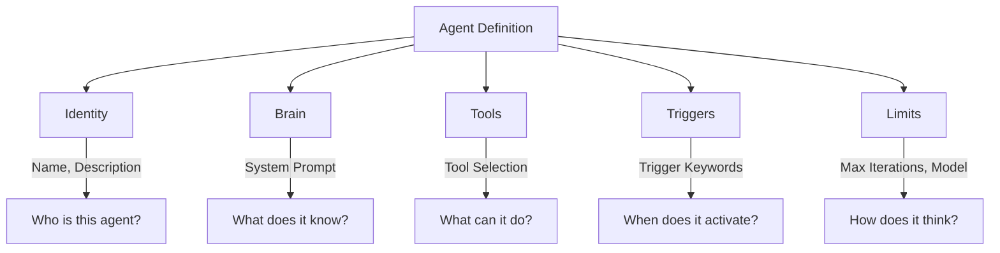

# Agent Builder

Create custom AI agents tailored to your team's specific workflows — no coding required.

## What It Does

The Agent Builder lets you define specialized agents that automate repetitive tasks. Think of agents as **AI team members** with specific skills:

- A **Deploy Checker** that verifies deployment readiness
- A **Security Reviewer** that scans code for vulnerabilities
- A **Sprint Reporter** that generates weekly sprint summaries
- A **Onboarding Agent** that answers questions about your codebase

> **For Team Leads & BAs:** You don't need to write code to create an agent. The visual UI lets you define what the agent does, what tools it has access to, and when it should be triggered — all through a form-based interface.

## Building Blocks of an Agent

Every agent is made of 5 building blocks:



### 1. Identity — Who is this agent?

| Field | Description | Example |
|-------|-------------|---------|
| **Name** | Display name | "Security Reviewer" |
| **Description** | What this agent does | "Reviews code for OWASP Top 10 vulnerabilities" |
| **Intent** | Unique identifier | `security_review` |

### 2. Brain — What does it know?

The **System Prompt** is the agent's core instruction set. This is where you encode your team's domain knowledge:

```
You are a senior security engineer at Acme Corp.
Review code against the OWASP Top 10 checklist.
Focus on: SQL injection, XSS, authentication bypass, 
insecure deserialization, and sensitive data exposure.
Our stack: Java 17 + Spring Boot 3 + PostgreSQL.
```

### 3. Tools — What can it do?

Select which tools the agent has access to. An agent with `gitlab_file` and `gitlab_comment` can read code and post review comments. An agent without `jira_write` can't modify tickets.

### 4. Triggers — When does it activate?

Define regex patterns that automatically route user prompts to this agent:

```regex
\bsecurity\s*(review|scan|check)\b
\bvulnerabilit(y|ies)\b
\bOWASP\b
```

If any pattern matches, this agent handles the request — with higher priority than built-in agents.

### 5. Limits — How does it think?

| Setting | Description | Default |
|---------|-------------|---------|
| **Model** | Which LLM to use | Project default |
| **Max Iterations** | Tool-call loop limit | 15 |

## How to Create an Agent

1. Navigate to **Agents** in the sidebar (or project sub-nav)
2. Click **New Agent**
3. Fill in the 5 building blocks
4. Click **Save**

The agent is immediately available for use. No restart required.

## Advanced Features

### Versioning & Rollback
Every update auto-saves the previous configuration. You can view version history and rollback to any previous version.

### Clone, Import & Export
- **Clone** a built-in agent to customize it
- **Export** an agent as JSON to share with other teams
- **Import** an agent from a JSON file

### Test Cases
Define test prompts to verify your agent behaves correctly before deploying to the team.

### Pipeline Editor

The visual **Pipeline Editor** is the core of the Agent Builder — an n8n-inspired node-based workflow designer where you build agent pipelines by dragging and connecting tools.

#### Three-Panel Layout

| Panel | Description |
|-------|-------------|
| **Tool Palette** (left) | Searchable list of 30+ tools — drag any tool onto the canvas to add it as a step |
| **Canvas** (center) | Node graph where you connect tools to define execution order. Snap-to-grid, zoom, and pan |
| **Properties** (right) | Click any node to edit its description, configure tool parameters, and manage dependencies |

#### How to Build a Pipeline

1. Set a **Workflow Goal** — describe what this pipeline achieves
2. **Drag tools** from the palette onto the canvas
3. **Connect nodes** by dragging from one node's output handle to another's input handle
4. **Configure parameters** — click a node to set tool-specific values (e.g., JSM URL, Jira project key)
5. **Test it** — enter a prompt and hit **▶ Run**

#### Dry Run vs Live Mode

| Mode | Description |
|------|-------------|
| 🔶 **Dry Run** | Tools execute with mocked responses — safe for testing pipeline logic |
| 🟢 **Live APIs** | Tools execute against real APIs (GitLab, Jira, etc.) — production behavior |

Toggle between modes with a single click. Each node shows its execution status in real-time:
- ⏳ **Pending** — waiting to execute
- ⟳ **Running** — currently executing
- ✓ **Success** — completed successfully
- ⏭ **Skipped** — mocked in dry run mode
- ✗ **Error** — execution failed

#### Config Validation

The editor automatically validates tool parameters. If a tool requires configuration (e.g., `jsm_url` for JSM integration), a warning badge appears on the node and a banner lists all missing parameters. Click any warning to jump directly to the configuration.

#### 🤖 AI Canvas Assistant

You don't have to build the pipeline manually! The Pipeline Editor includes an **AI Canvas Assistant** that can shape the DAG for you:

1. Click the **Assistant** button in the canvas header
2. Type a prompt like: *"Add a condition node connected to the start"*
3. The AI will parse your intent, construct the required nodes, and automatically place connecting edges on the canvas. 

This makes scaffolding complex workflows incredibly fast.

#### 🔑 Typed I/O & Output Keys

A powerful feature of the Pipeline Editor is its ability to route data between steps:
- **Output Key:** Click on any node and set its `Output Key` property (e.g., `git_diff_result`). The AgentRunner will save the result of this tool execution into the global StateEngine memory under this specific key.
- Downstream nodes can refer to this explicit output key without relying solely on the LLM's long-term conversational memory, making complex multi-step pipelines deterministic and reliable.

## How to Use

Once created, just use the trigger keywords in any conversation:

```
Run a security scan on MR !42
```

Or specify the agent explicitly:

```
@security_review Check this code for SQL injection vulnerabilities
```
