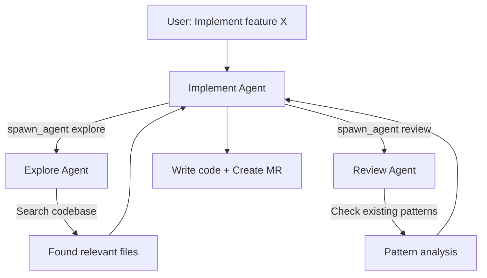

# Agent-to-Agent Communication

Agents can delegate tasks to other agents, enabling complex multi-step workflows.

## What It Does

When one agent encounters a subtask outside its expertise, it can **spawn a child agent** to handle it:

- A **code implementation** agent spawns an **explore** agent to search the codebase
- A **story generation** agent spawns an **architecture** agent to analyze dependencies
- A **review** agent spawns a **QA** agent to generate test cases

> **For teams:** This means the agent can tackle complex, multi-disciplinary tasks without you needing to break them down manually. It's like having a team of specialists that automatically collaborate.

## How It Works



### SpawnAgentTool

The `spawn_agent` tool creates isolated child sessions:

| Parameter | Description |
|-----------|-------------|
| **prompt** | Detailed task description |
| **description** | Short summary (3-5 words) |
| **agent_intent** | The type of child agent (`explore`, `review`, `implement`, `general`) |
| **task_id** | Optional: resume a previous child session |

Each child agent:
- Gets its own **conversation** (isolated from the parent)
- Has its own **tool set** based on intent
- Returns results to the parent wrapped in `<task_result>` tags
- Can be **resumed** later by passing the `task_id`

### AgileAgentRunner (Meta-Orchestrator)

For external channels, the `AgileAgentRunner` acts as a higher-level orchestrator:

1. Connects to the backend as an **MCP Client**
2. Discovers all available tools via `tools/list`
3. Uses the LLM to decide which tools to call
4. Manages per-user sessions (active project, avatar, history)

This enables external channel users to perform multi-step workflows that span multiple agent types.

## Example Workflow

```
User: "Implement the new login feature described in PVG-4523"

Implement Agent:
  ├── spawn_agent(explore): "Find existing auth code patterns"
  │   └── Returns: AuthService.ts, LoginController.ts patterns
  ├── spawn_agent(explore): "Find test patterns for auth"
  │   └── Returns: AuthService.test.ts patterns
  ├── clone_repo → create_branch → edit files
  ├── commit_files → create_merge_request
  └── Final: "MR !142 created with login feature implementation"
```
