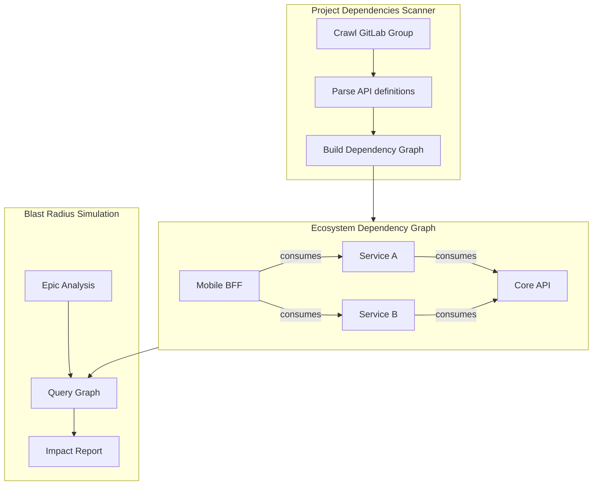

# Blast Radius Simulator

Detect the architectural impact of changes **before writing a single line of code**.

## What It Does

The Blast Radius Simulator answers the question: *"If we change this service, what else breaks?"*

It works by:
1. **Scanning your GitLab group** to map all API providers, consumers, and their relationships
2. **Building a dependency graph** stored in SQLite
3. **Intercepting Epic analysis** to proactively warn about cross-repository impacts

> **For Architects & POs:** Before starting work on an Epic, you'll know exactly which teams need to be involved, which APIs will require updates, and which consumers will be affected. No more surprise integration failures at the end of a sprint.

## How It Works



### Dependency Graph

The scanner creates two tables in SQLite:

- **`dependency_nodes`** — each repository with its API endpoints
- **`dependency_edges`** — provider → consumer relationships

### Impact Report

When analyzing an Epic, the simulator produces:

| Impact Level | Meaning |
|-------------|---------|
| 🟢 **None** | Change is isolated, no external impact |
| 🟡 **Low** | Downstream consumers exist but the API contract is unchanged |
| 🟠 **Medium** | API contract changes but backward-compatible |
| 🔴 **Breaking** | Breaking change — downstream consumers MUST update |

## Running the Scanner

Navigate to **Project Dependencies** in the sidebar:

1. Click **Scan** to start crawling your GitLab group
2. Watch the real-time progress
3. View the dependency graph visualization

The scanner runs in the background and can be scheduled via [Cron](/docs/features/cron-scheduler).

## How to Use

The blast radius is automatically included in story generation:

```
Create stories from epic PVG-4523
```

Or query it directly:

```
What is the blast radius if we change the authentication API in Core-Auth?
```
