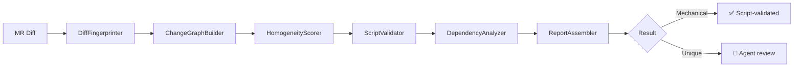

# Code Review

Agile Agent reviews Merge Requests automatically, handling even 200+ file MRs in minutes instead of hours.

## What It Does

When you paste a GitLab MR link or ask to "review MR #42", the agent:

1. **Fetches the diff** from GitLab
2. **Separates mechanical changes from logic changes** — renaming a variable across 50 files? That's verified by a script, not an LLM
3. **Reviews only the unique, meaningful changes** with the AI
4. **Posts inline comments** directly on the MR in GitLab

> **For teams:** A 200-file MR that takes a developer 2 hours to review can be analyzed in 2 minutes. About 50% of files in a large MR are typically mechanical changes (renames, config updates) that the transformer validates deterministically.

## How It Works

Large MRs (50+ files) trigger the **6-pass transformer pipeline** before the AI agent sees the code:



| Pass | What It Does |
|------|-------------|
| **DiffFingerprinter** | Classifies each file as rename, token_replace, field_add, config, or unique |
| **ChangeGraphBuilder** | Groups files by change pattern into homogeneous clusters |
| **HomogeneityScorer** | Scores each group: can a script validate it, or does it need AI? |
| **ScriptValidator** | Runs deterministic assertions (e.g., "old token has 0 remaining occurrences") |
| **DependencyAnalyzer** | Builds an import graph to create chunks of related files for context |
| **ReportAssembler** | Merges script validations and agent reviews into one final report |

## Output Format

The agent produces inline comments in a structured JSON format:

```json
<!-- CODE_COMMENTS_START -->
[
  {
    "file": "src/auth/login.ts",
    "line": 42,
    "severity": "warning",
    "comment": "This password comparison is not constant-time..."
  }
]
<!-- CODE_COMMENTS_END -->
```

These comments are automatically posted to GitLab as inline MR comments.

## How to Use

```
Review the merge request at https://gitlab.com/my-group/my-project/-/merge_requests/42
```

Or more specific:

```
Review MR !42 focusing on security vulnerabilities and SQL injection
```
