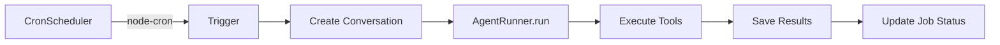

# Cron / Scheduled Workflows

Automate recurring tasks by scheduling agent prompts to run on a cron schedule.

## What It Does

Define background jobs that run automatically:

- **Daily standup reports** — "Summarize all tickets updated yesterday in sprint 42"
- **Weekly code quality checks** — "Review all open MRs older than 3 days"
- **Nightly dependency scans** — "Scan the GitLab group for new API dependencies"
- **Sprint readiness checks** — "Evaluate DoR for all stories in the current sprint"

> **For Scrum Masters & Team Leads:** Set it and forget it. Schedule the agent to run recurring analyses so you always have fresh reports waiting for you each morning — without manually triggering anything.

## How It Works



Each cron job:
1. **Triggers** based on a standard cron expression
2. **Creates a new conversation** titled `[Cron] <job name>` for traceability
3. **Runs the full agent pipeline** with the configured prompt and optional intent override
4. **Records the result** (success/error) and last run time

## Creating a Cron Job

Navigate to your project → **Cron Jobs** (or use the API). You can either click **New Cron Job** or use a **preset schedule** directly from the UI to auto-populate common schedules (like "Daily Start" or "Weekly End").

| Field | Description | Example |
|-------|-------------|---------|
| **Name** | Human-readable job name | "Daily Sprint Report" |
| **Cron Expression** | Standard 5-field format | `0 8 * * 1-5` (8 AM weekdays) |
| **Prompt** | What to ask the agent | "Summarize sprint progress" |
| **Intent Override** | Force a specific intent | `create_stories` (optional) |
| **Pipeline Node Link** | Target a specific step | `node-3f2a` (Triggers just this node in an orchestrator) |

### Cron Expression Quick Reference

```
┌───────────── minute (0-59)
│ ┌───────────── hour (0-23)
│ │ ┌───────────── day of month (1-31)
│ │ │ ┌───────────── month (1-12)
│ │ │ │ ┌───────────── day of week (0-7, 0 and 7 = Sunday)
│ │ │ │ │
* * * * *
```

| Expression | Schedule |
|-----------|----------|
| `0 8 * * 1-5` | 8:00 AM, Monday–Friday |
| `0 9 * * 1` | 9:00 AM every Monday |
| `*/30 * * * *` | Every 30 minutes |
| `0 0 * * *` | Midnight daily |

## Manual Trigger & Execution Logs

Click **Run Now** to execute a job immediately. The job runs in the background so you can continue working.

To view exactly what the agent did during a scheduled (or manual) run, you can access the **Execution Logs** directly from the Cron Jobs list. This will bring up a detailed view showing the prompt used, timestamp, status, and the agent's full returned message.

## Cron Jobs in Chat History

By design, **automated cron job runs are hidden from the primary Chat timeline**. This prevents background reporting from cluttering your day-to-day conversational history with the agent. You can always review cron job outputs via their dedicated Execution Logs interface.

## Monitoring

Each job tracks:
- **Last run time** — when it last executed
- **Last result** — `success` or `error`
- **Active status** — whether the scheduler has it loaded

All job results are stored as conversations, so you can review the full output anytime.
