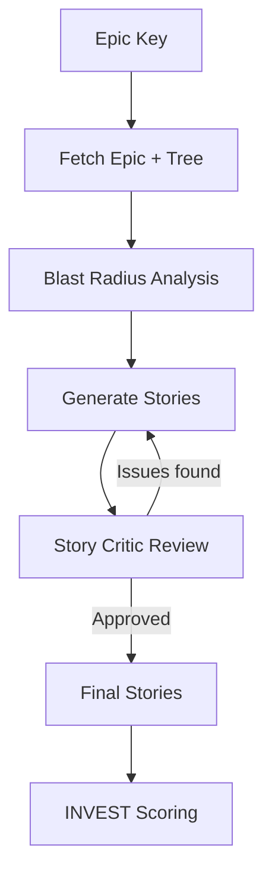

# Story Generation

Automatically generate user stories from Jira Epics with structured Acceptance Criteria, INVEST scoring, and architectural impact warnings.

## What It Does

Paste a Jira Epic key and the agent will:

1. **Read the Epic** and all its linked tickets and subtasks
2. **Analyze the dependency graph** to check for architectural impacts
3. **Generate user stories** with full Acceptance Criteria
4. **Run adversarial debate** — a "Story Critic" challenges each story for completeness
5. **Produce a final set** of independent, testable stories ready for sprint planning

> **For Product Owners & BAs:** Instead of spending hours manually breaking down an Epic, get a structured set of stories in minutes. Each story includes Acceptance Criteria, INVEST scoring, and warnings about cross-team dependencies you might miss.

## How It Works



### Blast Radius Integration

Before generating stories, the agent queries the **Ecosystem Dependency Graph** to identify:

- **Upstream APIs** your Epic depends on
- **Downstream consumers** that will be affected
- **Breaking changes** that need dedicated stories or spikes

These warnings are embedded directly in the Acceptance Criteria so QA teams know which interfaces to test.

### Adversarial Debate

Each story goes through a "Story Critic" who verifies:

- Is the story **Independent** from other stories?
- Is it **Negotiable** (not over-specified)?
- Is it **Valuable** to the end user?
- Is it **Estimatable** by the development team?
- Is it **Small** enough for one sprint?
- Is it **Testable** with clear pass/fail criteria?

## How to Use

```
Create user stories from epic PVG-4523
```

```
Generate stories for BACKEND-891 with a focus on API backward compatibility
```

## Example Output

```markdown
## US-001: As a user, I want to reset my password via email

**Story Points:** 3
**INVEST Score:** 4.5/5

### Acceptance Criteria
- [ ] User receives reset email within 60 seconds
- [ ] Reset link expires after 24 hours
- [ ] Password must meet complexity requirements
- [ ] ⚠️ BLAST RADIUS: Auth-Service v2 API consumers
      (Core-Gateway, Mobile-BFF) must handle new 
      `password_reset_pending` status
```
