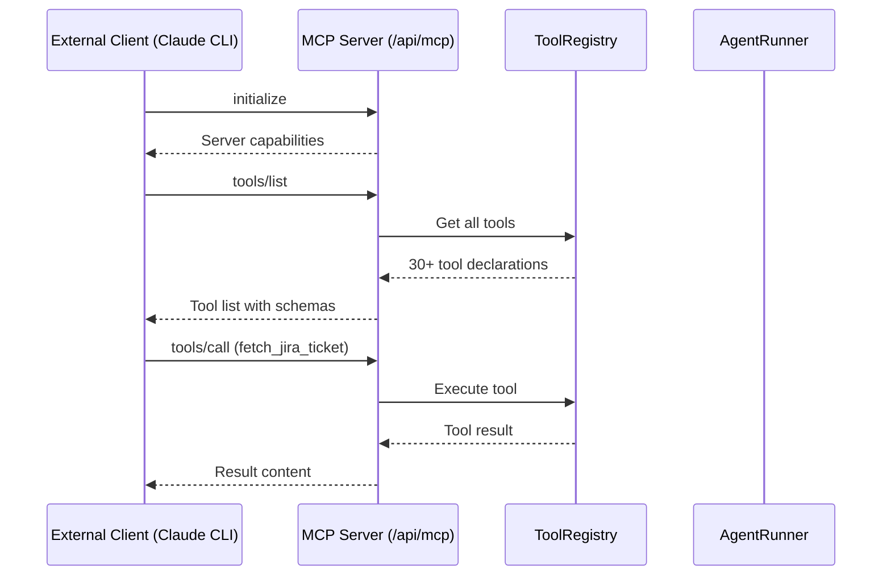

# MCP Server

Agile Agent exposes a **Model Context Protocol (MCP)** server so external AI clients can use all of its tools.

## What It Does

The MCP server turns Agile Agent into a **tool provider** for other AI systems:

- **Claude CLI** can review your MRs using Agile Agent's GitLab tools
- **Cursor** can generate stories using the Jira integration
- **VS Code Copilot** can run blast radius analysis
- **Any MCP-compatible client** can discover and call your tools

> **For developers:** If you already use Claude, Cursor, or another AI tool, you don't have to switch. Just point your tool at Agile Agent's MCP endpoint and it gets access to all 30+ built-in tools, custom tools, and the ability to run full agent workflows.

## How It Works



## JSON-RPC Methods

| Method | Description |
|--------|-------------|
| `initialize` | Handshake — returns server name, version, and capabilities |
| `tools/list` | Lists all available tools with JSON Schema parameters |
| `tools/call` | Executes a tool by name with arguments |

## Key Tools via MCP

### `run_agent` — Execute a full agent workflow

| Parameter | Type | Description |
|-----------|------|-------------|
| `prompt` | string | The prompt to send to the agent |
| `agent_id` | string | Agent definition ID |
| `agent_intent` | string | Agent intent (e.g., `review`, `implement`) |
| `live_apis` | boolean | `false` (default) = dry run, `true` = live execution |

### `validate_agent` — Check agent configuration

Returns a report listing any missing required parameters.

### `update_agent_config` — Fix agent configuration

Update tool configuration parameters (e.g., set `jsm_url` for the JSM tool).

## Connecting External Clients

### Claude CLI

```bash
claude mcp add agile-agent http://localhost:4372/api/mcp
```

### Cursor / VS Code

Add to your MCP configuration:

```json
{
  "mcpServers": {
    "agile-agent": {
      "url": "http://localhost:4372/api/mcp"
    }
  }
}
```

## llms.txt

Agile Agent also exposes a `/api/docs/llms.txt` endpoint — a plaintext summary of all documentation optimized for LLM consumption, similar to Stripe's `llms.txt`.
